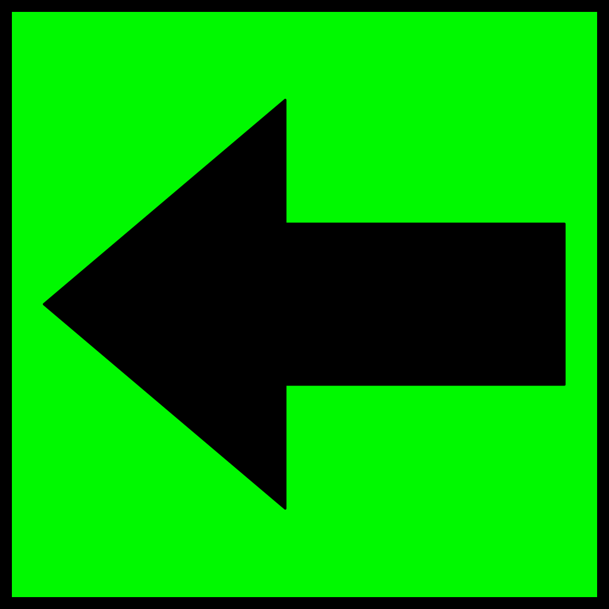

aframe-maze-component
==
A component for building VR mazes
--

  
  
  
  
  
  </a>

## Browser Usage 

### Live Example 

Here are some live examples of the component. The simpler demo is ideal for mobile. 

* https://mitchallen.bitbucket.io - best viewed in Chrome
* https://mitchallen.bitbucket.io/stats.html - Chrome demo displaying stats 
* https://mitchallen.bitbucket.io/simple.html - simpler demo for mobile

Demo notes:

* Lowered or removed birds-eye platform to try to reduce issues with users falling through the floor
* For birds-eye demos:
 * Start to move forward until you fall onto the lower platform
 * WAIT a second or two - then proceed onto the ground
 

* Works fine in Chrome on a Mac
* On Windows 10 machine (Lenovo Yoga 710 laptop) can't seem to walk and turn at the same time

* Physics engine issues:
 * Having issues with player falling through floor on iOS for complex demos
 * Keep it simple on mobile, don't have player drop from high position
 * Play can push through or into objects if determined
 * If player pushes angled object, could push them right through the floor (like trying to push up against something while standing in sand - but you end up falling to infinity)

* * *

### HTML Example

Run this example in a browser. Step off the birds-eye view platform and wander around the maze.

    <!DOCTYPE html>
    <html>
      <head>
        <meta charset="utf-8">
        <title>demo: aframe-maze-component</title>
        <meta name="description" content="demo: aframe-maze-component">        
        
        
         
        

      </head>
      <body>
        <a-scene>
          <a-assets>
            
            
            <a-box id="wall-one" 
              static-body material="src: #texture-wall" 
              depth="1" width="4" height="1"></a-box>
            <a-cylinder id="end-cap"
              static-body color="#444444" 
              depth="1.1" width="1.1" height="2"
              radius="0.5"></a-cylinder>
          </a-assets>
          <a-sky id="sky" color="#0000ff"></a-sky>
          <a-box id="center" 
              position="0 0 0"
              color="red" 
              depth="0.5" width="0.5" height="10"></a-box>
          <a-entity id="player"
              camera
              universal-controls
              kinematic-body
              position="-20 10.8 20">
          </a-entity>
          <!-- birds-eye view box to stand on -->
          <!-- lower platform -->
          <a-box static-body 
              depth="0.25" height="1" width="1" 
              position="-20 9.8 20"
              rotation="-90 0 0"
              color="tomato"></a-box>
  
          <a-entity id="maze1" 
              maze='size: 5 6; wall: #wall-one; cap: #end-cap; open: S 0 N 1 2 4 E 5;' 
              position='0 0.5 0'
              rotation='0 0 0'></a-entity>

          <a-entity id="maze2" 
              maze='size: 7 3; wall: #wall-one; cap: #end-cap; open: W 2 N 2 6;' 
              position='30 0.5 0'
              rotation='0 45 0'></a-entity>

          <a-entity id="maze3A" 
              maze='size: 5 6; wall: #wall-one; cap: #end-cap; open: S 0 N 4;' 
              position='25 0.5 -30'></a-entity>

          <a-entity id="maze3B" 
              maze='size: 5 6; wall: #wall-one; cap: #end-cap 0.4;' 
              position='25 4 -30'></a-entity>
              
          <a-entity id="maze4" 
              maze='size: 4 5; wall: #wall-one; cap: #end-cap;' 
              position='10 0.5 30'></a-entity>
              
           <a-entity id="maze5" 
              maze='size: 4 5;' 
              position='-30 0.5 -5'></a-entity>

          <a-grid id="ground" width="200" height="200" static-body material="src: #texture-floor"></a-grid>
        </a-scene>
      </body>
    </html>
    
### Include Script

Include the latest script. Update the @version in the URL as needed:

    
    
### Define Assets

Create an __a-assets__ section and add the following:

* an __img__ to act as a material for the maze walls
* an entity, like __a-box__, to act as a wall
* an entity, like __a-cylinder__, to act as a cap at each cell corner in the maze

Be sure to give each entity unique __id__ attributes. They will be needed to define the maze.

The example below uses the __static-body__ component from __[aframe-extras](https://github.com/donmccurdy/aframe-extras)__ so the player can not go through the walls.

    <a-assets>
      
      <a-box id="wall-one" 
        static-body material="src: #texture-wall" 
        depth="1" width="4" height="1"></a-box>
      <a-cylinder id="end-cap"
        static-body color="#444444" 
        depth="1.1" width="1.1" height="2"
        radius="0.5"></a-cylinder>
    </a-assets>

### Create an Entity with a Maze Component

A __maze__ component can consist of the following:

* __size__ - dimension, in cells, of the size of the maze (__size: 5 6;__)
* __wall__ - the __id__ of the entity asset that will be used to create walls of the maze (__wall: #wall-one;__)
  * the __width__ of the entity will be used to determine the cell size of the maze
* __cap__ - the __id__ of the entity asset that will be used to create the end caps of the maze (__cap: #end-cap;__)
  * __cap height adjust__ - a height adjustment value can follow the cap id to adjust the cap in relation to the maze walls (cap: #end-cap __0.4__;')
  * adjust the __width__ and __depth__ of the cap entity to be slightly larger than the maze wall to prevent video jitters as the planes fight to occupy the same space
* __open__ - a list of border walls that can be opened to allow entering and existing (__open: S 0 N 1 2 4 E 5;__)
  * format: *border cell ids*, *border cell ids*, ...
  * border can be __N__, __E__, __W__, __S__ to represent the north, east, west and south borders
  * cell ids are a zero based index along the border representing each cell wall to open
  * zero (__0__) is the upper left / first column (__N 0__ - opens top left wall, __E 0__ opens right-side top wall, __W 0__ opens left-side top wall, __S 0__ opens bottom left wall)
  * multiple border walls can be opened up (__N 0 3 4__)
  * multiple borders can be opened at the same time (__open: S 0 N 1 2 4 E 5;__)

Example maze with no open walls:

    <a-entity id="maze4" 
      maze='size: 4 5; wall: #wall-one; cap: #end-cap;' 
      position='10 0.5 30'></a-entity>

A maze with open walls:

    <a-entity id="maze1" 
        maze='size: 5 6; wall: #wall-one; cap: #end-cap; open: S 0 N 1 2 4 E 5;' 
        position='0 0.5 0'></a-entity>
        
Example with cap adjustment (cap: #end-cap __0.4__;'). This is useful in cases where the maze is above the player. It prevents the bottoms of the walls and caps from battling to display in the same space. It's most evident when the player is walking under the maze. This moves the two bottoms away from each other.
          
    <a-entity id="maze3B" 
        maze='size: 5 6; wall: #wall-one; cap: #end-cap 0.4;' 
        position='25 4 -30'></a-entity>
        
Example maze with only dimensions defined. Generic walls will be created:

    <a-entity id="maze5" 
      maze='size: 4 5;' 
      position='-30 0.5 -5'></a-entity>
      
### Adding / Removing Through JavaScript

An example of how to remove and add maze attributes though JavaScript. The target element should be an __a-entity__.

__NOTE:__ In testing we've seen that sometimes the remove call fails and you end up with two overlapping mazes. Use with caution.

    
    
* * *

## NPM Installation

The module should be converted for client use using [browserify](http://browserify.org/):

    $ npm init
    $ npm install aframe-maze-component --save
    
### Browserify Example

Below is an example of requiring the module within a file to be passed to browserify.

The modules named export, __Component__, should be passed to __AFRAME.aframeCore.registerComponent__:

    // Browser distribution of the A-Frame component.
    (function () {
      if (typeof AFRAME === 'undefined') {
        console.error('Component attempted to register before AFRAME was available.');
        return;
      }

      var maze = require('aframe-maze-component');

      // Register all components here.
      var components = {
        "maze": maze.Component
      };

      var primitives = {
      };

      Object.keys(components).forEach(function (name) {
        if (AFRAME.aframeCore) {
          AFRAME.aframeCore.registerComponent(name, components[name]);
        } else {
          AFRAME.registerComponent(name, components[name]);
        }
      });

      Object.keys(primitives).forEach(function (name) {
        if (AFRAME.aframeCore) {
          AFRAME.aframeCore.registerPrimitive(name, primitives[name]);
        } else {
          AFRAME.registerPrimitive(name, primitives[name]);
        }
      });

    })();
    
### Build with grunt

Use a [grunt](http://gruntjs.com/) task to build the distribution file:

    browserify: {
        dist: {
            options: {
                browserifyOptions: {
                    // ...
                },
                transform: [['babelify', {presets: ['es2015']}]],
                    plugin: [[ "browserify-derequire" ]]
                },
            files: {
               // substitute your component name for the distribution file
               "./dist/YOUR-COMPONENT.js": ["./browser.js"]
            }
        }
    },
    
For more information, review the __Gruntfile.js__ and __package.json__ files in the root of this projects source code.
      
* * *

## Testing

To test, go to the root folder and type (sans __$__):

    $ npm test
   
* * *
 
## Repo(s)

* [bitbucket.org/mitchallen/aframe-maze-component.git](https://bitbucket.org/mitchallen/aframe-maze-component.git)
* [github.com/mitchallen/aframe-maze-component.git](https://github.com/mitchallen/aframe-maze-component.git)

* * *

## Contributing

In lieu of a formal style guide, take care to maintain the existing coding style.
Add unit tests for any new or changed functionality. Lint and test your code.

* * *

## Version History

#### Version 0.1.25

* Updated doc to refer to 0.1.24
* Lowered or removed birds-eye platform in local examples (too many physics engine fails - user falls through floor)

#### Version 0.1.24

* Fixed test case that was broken by default vec2 update

#### Version 0.1.23

* Updated examples to use 0.1.22
* Updated readme on ways to reduce falling through the floor
* Updated referenced bitbucket.io examples to use 0.1.22
* Pending: investigate new test failures

#### Version 0.1.22

* Fixed internal issue with default size vec2 format
* Updated examples with latest external dependencies
* Added lower jump platform to examples to reduce fall through?

#### Version 0.1.21

* Updated doc to point to new demo locations on bitbucket.

#### Version 0.1.20

* updated grunt-upcoming to version 0.2.0

#### Version 0.1.19

* updated version history

#### Version 0.1.18

* updated grunt-upcoming to version 0.1.9

#### Version 0.1.17

* updated grunt-upcoming to version 0.1.8

#### Version 0.1.16

* now uses grunt-upcoming to determine product version when published

#### Version 0.1.15

* added grunt task to resolve product version issue

#### Version 0.1.14

* package name and version now echoed to console on browser.js load

#### Version 0.1.13

* updated mockbot-document dev dependency to 0.1.12

#### Version 0.1.12

* updated mockbot-document dev dependency to 0.1.11

#### Version 0.1.11

* tests now use mockbot-document for simulating the browser document

#### Version 0.1.10

* updated code coverage to 100%

#### Version 0.1.9

* updated dependency
* integrated with travis-ci and codecov.io
* added test cases for code coverage

#### Version 0.1.8

* fixed readme formatting issue

#### Version 0.1.7

* changed license from ISC to MIT and added LICENSE file
* added badges to readme
* updated examples to use latest cdn distribution

#### Version 0.1.6

* fixed bug where init wasn't trimming '#' from wall id, resulting in 100% failed doc queries

#### Version 0.1.5

* updated documentation, test files and examples (no core changes)

#### Version 0.1.4

* no longer draws default end caps if none are defined

#### Version 0.1.3

* updated doc with notes about running under iOS
* added section on cdn script usage
* added example gif image

#### Version 0.1.2

* updated example 

#### Version 0.1.1 

* removed dist from .npmignore
* added cdn distribution example

#### Version 0.1.0 

* initial release

* * *
